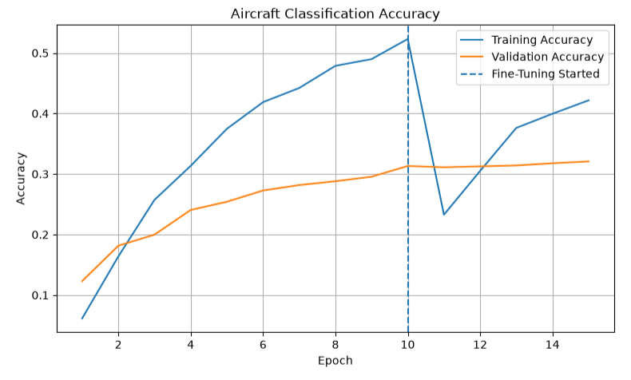
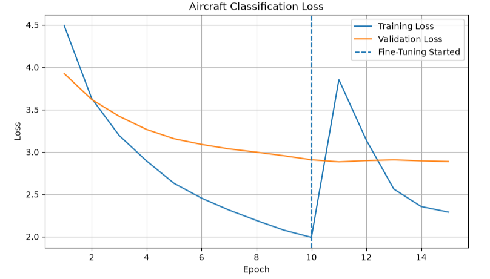

# ✈️ Aircraft Classification using TensorFlow

An end-to-end deep learning project that classifies **100 aircraft variants** using the **FGVC Aircraft Dataset**. The project leverages **transfer learning with MobileNetV2**, TensorFlow data pipelines, and fine-tuning to build an image classification model capable of distinguishing visually similar aircraft.

---

## Project Overview

This project demonstrates the complete deep learning workflow from raw image data to model evaluation. The primary objective was to build a classifier capable of recognizing aircraft variants despite subtle visual differences between classes.

### Skills Demonstrated

- Deep Learning with TensorFlow/Keras
- Transfer Learning
- Fine-Tuning Pretrained Models
- Image Preprocessing
- TensorFlow Data Pipelines (`tf.data`)
- Data Augmentation
- Model Evaluation
- Classification Metrics
- Jupyter Notebook Development

---

## Dataset

**FGVC Aircraft Dataset**

- **100 aircraft variants**
- **~10,000 aircraft images**
- Training, validation, and testing splits
- Fine-grained aircraft classification benchmark

> **Note:** The dataset is not included in this repository due to its size. It can be downloaded from the official FGVC Aircraft Dataset website.

---

## Technologies

- Python
- TensorFlow / Keras
- NumPy
- Pandas
- Matplotlib
- Pillow
- Scikit-learn
- Jupyter Notebook

---

## Model Architecture

The model uses **MobileNetV2** pretrained on **ImageNet** as the feature extractor.

### Pipeline

```
Input Image
      │
Data Augmentation
      │
MobileNetV2 (Pretrained)
      │
Global Average Pooling
      │
Dropout
      │
Dense Softmax Layer
      │
100 Aircraft Classes
```

Transfer learning was first performed with the pretrained backbone frozen. The final 30 layers were then unfrozen and fine-tuned using a smaller learning rate to improve aircraft-specific feature learning.

---

## Results

| Metric | Value |
|---------|-------:|
| Number of Classes | 100 |
| Training Images | 3,334 |
| Validation Images | 3,333 |
| Testing Images | 3,333 |
| Final Test Accuracy | **29.7%** |


### Training Accuracy



### Training Loss



Although the overall accuracy appears modest, this dataset represents a **fine-grained classification problem**, where many aircraft variants have extremely similar visual characteristics. Distinguishing between these aircraft is significantly more challenging than standard image classification datasets.

---

## Repository Structure

```
Aircraft-Classification/
│
├── Aircraft_Classification.ipynb
├── aircraft_classifier.keras
├── class_names.txt
├── README.md
├── requirements.txt
└── .gitignore
```

---

## Future Improvements

Possible enhancements include:

- Experimenting with EfficientNet and ResNet architectures
- Hyperparameter optimization
- Higher-resolution image inputs
- Stronger data augmentation techniques
- Learning rate scheduling
- Class imbalance analysis
- Top-5 accuracy evaluation

---

## How to Run

1. Clone the repository.
2. Install the required packages:

```bash
pip install -r requirements.txt
```

3. Download the FGVC Aircraft Dataset and place it in the expected directory.
4. Open `Aircraft_Classification.ipynb`.
5. Run the notebook from top to bottom.

---

## Author

**Nathan Cao**

Data Science & Machine Learning Portfolio Project
